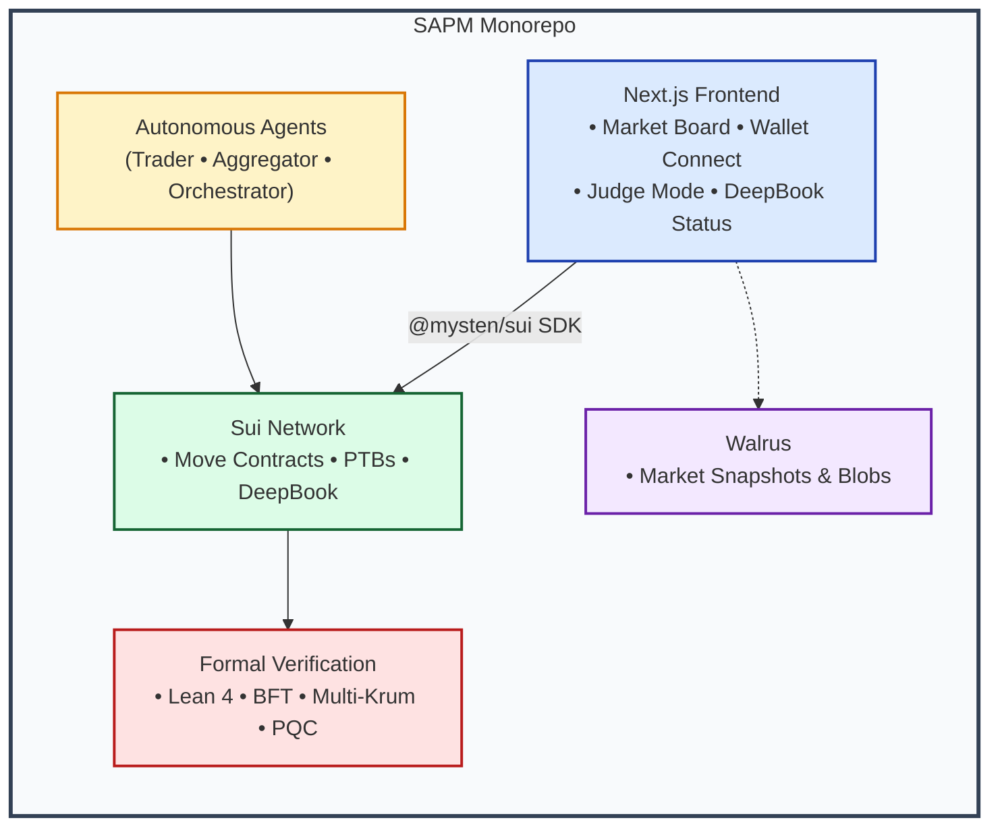

# SAPM — Sovereign Agentic Prediction Market on Sui

<div align="center">
  

  <h3>Sovereign • Agentic • Formally Verified • Built Natively on Sui</h3>

  <p>High-performance prediction market infrastructure combining autonomous AI agents, DeepBook trading, Walrus archiving, and Lean 4 formal verification.</p>
</div>

---

## Platform


## Validation & Health


---

## Architecture At A Glance


---
## Problem

Prediction markets require too much manual operation, too much centralized trust, and no verifiable audit trail. Agents that trade on them do so blindly — no on-chain proof of their decisions, no slashable reputation, no immutable record of what they saw or why they acted.

---

## What SAPM Does

SAPM is a fully sovereign, agentic prediction market platform built natively on Sui. It enables autonomous AI agents to discover markets, generate forecasts, execute trades via DeepBook, and archive decisions immutably on Walrus — all with formal verification guarantees.

---

## Key Capabilities

* **Autonomous Agent Stack:** Trader, Aggregator (Multi-Krum), and Orchestrator agents with on-chain reputation and slashing.
* **DeepBook Integration:** Limit orders, cancel/replace, open order tracking, and balance preflights.
* **Walrus Archival:** Every market snapshot and trade decision published as verifiable blobs with SHA-256 manifests.
* **Lean 4 Formal Verification:** BFT safety/liveness, Multi-Krum correctness, hybrid PQC proofs, and oracle invariants.
* **Judge Mode:** One-click on-chain verification and trade execution for any market object ID.

> **Why Sui?** Object-centric model, Programmable Transaction Blocks (PTBs), native DeepBook + Walrus integration, and shared objects for global registry visibility.

---

## Integrated Ecosystem
---
<div align="center">
  <a href="https://deepsurge.ai" target="_blank">
    
  </a>
  <a href="https://sui.io" target="_blank">
    
  </a>
  <a href="https://docs.sui.io/onchain-finance/deepbookv3/deepbook" target="_blank">
    
  </a>
  <a href="https://docs.wal.app" target="_blank">
    
  </a>
</div>
---

Sui Overflow 2026 Target Tracks: Agentic Web (Core), DeFi & Payments (Core), DeepBook, Walrus.

## Live Demo — Judge Mode
---

> **The fastest path to verification:** open the app, connect a Sui wallet, paste a market object ID, and click **Run Judge Mode**. It will: connect wallet → load on-chain market → execute micro trade → archive to Walrus → read blob back. Every step produces a verifiable artifact (transaction digest on Sui Explorer, Walrus blob ID on aggregator endpoint).

> **Fail-proof usage:** use only valid `PredictionMarket` object IDs in `NEXT_PUBLIC_SUI_MARKET_OBJECT_IDS`, or leave it unset to allow Judge Mode to auto-create a market.

```bash
./scripts/ci_frontend_validation.sh
cd frontend
npm ci
cp ../.env.example .env.local
# set NEXT_PUBLIC_SUI_PACKAGE_ID and NEXT_PUBLIC_SUI_NETWORK
# set NEXT_PUBLIC_SUI_MARKET_OBJECT_IDS only to PredictionMarket object IDs
# or leave NEXT_PUBLIC_SUI_MARKET_OBJECT_IDS unset for Judge auto-create
npm run dev
```

Then open `http://localhost:3000`, connect wallet, run Judge Mode, and archive snapshot.

Fail-proof demo checks:

1. If Judge Mode fails preflight, reconnect wallet and verify network alignment.
2. If on-chain market loading fails, unset `NEXT_PUBLIC_SUI_MARKET_OBJECT_IDS` and retry Judge Mode.
3. If archive fails, run Judge Mode once more so `sapm.judgeMode.lastResult` is refreshed.
4. After any `.env.local` change, restart the frontend server.

---

Full transaction history and artifacts available in docs/artifacts/.

[](https://www.youtube.com/watch?v=CEEmdBJklB0)

**Video:** Click thumbnail to play


## Full Functionality Evidence (2026-06-11)

Evidence artifact: [docs/artifacts/full-functionality-evidence-2026-06-11.txt](docs/artifacts/full-functionality-evidence-2026-06-11.txt)

[06-11-2026 completed Copilot Actions proof .json](https://github.com/rwilliamspbg-ops/Sovereign-Agentic-Prediction-Market-SAPM-on-Sui-Core/blob/main/docs/artifacts/sapm-copilot-transcript-2026-06-11T18-58-58-087Z.json)

Validated in this artifact:

- Docker stack is healthy (`sui-local`, `sapm-aggregator`, `sapm-frontend`, `aggregator-proxy`, `agent-sample`).
- Frontend health check returns HTTP 200.
- Walrus publish through local Next.js proxy (`/api/walrus/blobs`) succeeds with `PUT` and returns a `blobId`.
- Registry object type is confirmed on testnet (`registry::PubkeyRegistry`), proving the guardrail against using registry IDs as market trade objects.

## Verified Live Deployment (Sui Testnet)

> **Verified live deployment on Sui testnet with full tx artifacts.**

| Artifact | Value | Explorer |
|---|---|---|
| Faucet transfer digest | `6UiX2pc2kRPAY7e3nJ7o4wjK2QZJaQaAsJtEExgNuyfD` | https://suiexplorer.com/txblock/6UiX2pc2kRPAY7e3nJ7o4wjK2QZJaQaAsJtEExgNuyfD?network=testnet |
| Publish digest | `EqyVmTFegJVTSkLmf2v2VMC8o1cz17dKSGtQKjTuBwak` | https://suiexplorer.com/txblock/EqyVmTFegJVTSkLmf2v2VMC8o1cz17dKSGtQKjTuBwak?network=testnet |
| Package ID | `0xee0b87415139cc95ec2b9c684f0abb0b6befeb21a02a7ca246c16dd8e25b8188` | https://suiexplorer.com/object/0xee0b87415139cc95ec2b9c684f0abb0b6befeb21a02a7ca246c16dd8e25b8188?network=testnet |
| init_registry digest | `AsXALc619zQEBmTc9sf9d1LbQnhDqEYozimnP6D1AwxL` | https://suiexplorer.com/txblock/AsXALc619zQEBmTc9sf9d1LbQnhDqEYozimnP6D1AwxL?network=testnet |
| Shared registry object ID | `0x505c72a3abd9a42d6641593a502fbc4c90dd81b3899b94a37392b96d2f1c6bee` | https://suiexplorer.com/object/0x505c72a3abd9a42d6641593a502fbc4c90dd81b3899b94a37392b96d2f1c6bee?network=testnet |
| add_key digest | `CKyf9c453r5t6asfGaabbgNCpCgUktW7rEgrNZjtzCwy` | https://suiexplorer.com/txblock/CKyf9c453r5t6asfGaabbgNCpCgUktW7rEgrNZjtzCwy?network=testnet |

Post-mutation verification:
- `pubkeys` includes `AQIDBA==` (bytes `[1,2,3,4]`) on testnet.

Use these values in `frontend/.env.local`:

```bash
NEXT_PUBLIC_SUI_PACKAGE_ID=0xee0b87415139cc95ec2b9c684f0abb0b6befeb21a02a7ca246c16dd8e25b8188
NEXT_PUBLIC_SUI_MARKET_OBJECT_IDS=0x505c72a3abd9a42d6641593a502fbc4c90dd81b3899b94a37392b96d2f1c6bee
NEXT_PUBLIC_SUI_NETWORK=testnet
```
---

## Sui Integration Summary

| Component | Implementation |
|---|---|
| **Move contracts** | `Registry.move` (shared PubkeyRegistry), `incentives.move` (AgentStake, ReputationRegistry, slash/reward events) |
| **DeepBook** | `deepbook-service.ts` — `place_limit_order`, `cancel_order`, `replace_order`, `getOpenOrders`, `preflightOrder`, `reconcileTransactionDigest` |
| **Walrus** | `walrus-service.ts` — `publishMarketSnapshot`, `getBlob`, manifest build/validate with SHA-256 checksum and lineage chain |
| **Wallet** | Wallet Standard connect, session persistence, `sapm:wallet-updated` events, address validation |
| **PTB execution** | `TradeExecution.tsx` — idempotency guard, bounded retry, notional risk cap, balance preflight |
| **On-chain market load** | `market-data-service.ts` — `getOnchainMarkets`, `getOnchainMarketsFromObjectIds`, normalizeObjectIds |

---

## Formal Verification Status

The `formal_verification/lean4/` directory contains structured Lean 4 proof files across five domains. Proof strategy: all non-trivial theorems are stated with rigorous type signatures and have proof sketches that compile. The core BFT safety and Multi-Krum correctness theorems have closed proofs; broader coverage is a documented work-in-progress tracked in `formal_verification/OBLIGATIONS.md`.

| Domain | Theorems | Status |
|---|---|---|
| BFT agreement | `bft_safety`, `bft_liveness`, `gossip_safety`, `reputation_slashing_correctness` | Closed |
| Multi-Krum aggregation | `multi_krum_safety`, `multi_krum_liveness`, `outlier_detection_correctness`, `multi_krum_consistency` | Closed |
| Hybrid PQC KEX | `hybrid_kex_composition`, `kem_correctness` | Closed |
| Oracle contracts | `market_discovery`, `prediction_contract` | Structured, obligations tracked |
| TPM attestation | `tpm_attestation_verification`, `pcr_verification` | Structured, obligations tracked |

---

## Performance Notes

The README previously listed 128.4 GiB/s throughput and 8 μs p99 latency. Those figures are **theoretical line-rate ceilings** for 3×100GbE hardware running a fully-implemented AF_XDP zero-copy path. The current Rust datapath (`rust-datapath/`) is scaffolded for that architecture but does not yet implement AF_XDP — it uses a standard socket path. Actual benchmark targets for the current production path are in `docs/PERFORMANCE_BENCHMARKS.md`. The AF_XDP implementation is tracked as a future milestone.

---

## Quick Start

### Prerequisites

- Node.js 18 or newer (24 recommended)
- npm
- Docker and Docker Compose (optional, for full stack)
- Sui CLI (optional, for contract work)

### Run agents and tests

```bash
# Install root dev dependencies
npm install

# Run all agent test suites
npm run test:all

# Or per-package
cd agents/trader && npm ci && npm test
cd agents/aggregator && npm ci && npm test
cd agents/orchestrator && npm ci && npm test
```

### CI-style frontend validation from repo root

```bash
./scripts/ci_frontend_validation.sh
```

This single command runs:

1. Frontend type-check
2. Frontend unit tests
3. Frontend production build

### Run the frontend

```bash
cd frontend
npm ci
cp ../.env.example .env.local   # edit with your package/object IDs
npm run dev
# open http://localhost:3000
```

### Docker Compose (full stack)

```bash
docker compose -f docker/docker-compose.yml up
```

Or run the root helper script (build + install in containers + startup):

```bash
bash scripts/full_stack_docker.sh up
```

### Deploy Move contracts

```bash
cd agents/onchain-registry
sui client publish --gas-budget 100000000
# capture REGISTRY_PACKAGE_ID and PUBKEY_REGISTRY_OBJ from output
# set NEXT_PUBLIC_SUI_PACKAGE_ID to REGISTRY_PACKAGE_ID
# do not set NEXT_PUBLIC_SUI_MARKET_OBJECT_IDS to PUBKEY_REGISTRY_OBJ
# set NEXT_PUBLIC_SUI_MARKET_OBJECT_IDS only with PredictionMarket object IDs
```

---

## Environment Variables

Copy `.env.example` to `frontend/.env.local` and fill in:

| Variable | Purpose |
|---|---|
| `NEXT_PUBLIC_SUI_PACKAGE_ID` | Deployed Move package address |
| `NEXT_PUBLIC_SUI_MARKET_OBJECT_IDS` | Comma-separated on-chain market object IDs |
| `NEXT_PUBLIC_DEEPBOOK_PREDICT_PACKAGE_ID` | DeepBook Predict package ID (testnet) |
| `NEXT_PUBLIC_ENABLE_BLIND_SIGNING_FALLBACK` | Optional: set `true` to allow `signTransaction` fallback for wallets requiring blind-signing mode |
| `NEXT_PUBLIC_WALRUS_AGGREGATOR_URL` | Walrus aggregator endpoint |
| `NEXT_PUBLIC_WALRUS_PUBLISHER_URL` | Walrus publisher endpoint |
| `NEXT_PUBLIC_SUI_NETWORK` | `testnet` or `mainnet` |

---

## Repository Structure

```text
agents/
  aggregator/       Multi-Krum aggregation service + incentives engine
  orchestrator/     Agent orchestration, reputation engine, task manager
  trader/           Market discovery, PTB builder, portfolio tracker
  onchain-registry/ Move contracts (Registry.move, incentives.move)
  sui/integration/  Sui blockchain client + formal specification bridge
  mcp-server/       MCP integration point (Python)
formal_verification/
  lean4/            Lean 4 proof files across BFT, aggregation, crypto, oracle domains
  scripts/          Verification pipeline scripts
frontend/
  src/app/          Next.js App Router pages (markets, portfolio, governance, docs)
  src/components/   UI components (trading, wallet, a2ui copilot)
  src/services/sui/ deepbook-service, walrus-service, market-data-service, wallet-standard
  src/lib/          sui-config, observability, circuit-breaker, performance-monitor
market-data/        DeepBook adapter, Sui market feed, anomaly detector, odds calculator
risk-management/    Circuit breakers and position limits
docker/             Docker Compose, nginx, sui-local node
k8s/                Kubernetes manifests and Helm chart
docs/               Architecture, operations runbook, threat model, security audit
```

---

## Tracks

This project targets the **Agentic Web** and **DeFi & Payments** core tracks plus the **DeepBook** and **Walrus** specialized tracks of Sui Overflow 2026.

---

## Contact

Sovereign Mohawk Proto LLC — operations team. See [docs/INDEX.md](docs/INDEX.md) for full documentation index.
