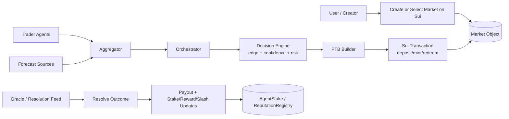

# SAPM - Sovereign Agentic Prediction Market on Sui

[](https://github.com/rwilliamspbg-ops/Sovereign-Agentic-Prediction-Market-SAPM-on-Sui-Core/actions/workflows/ci.yml)
[](https://github.com/rwilliamspbg-ops/Sovereign-Agentic-Prediction-Market-SAPM-on-Sui-Core/actions/workflows/ci_validation.yml)
[](https://github.com/rwilliamspbg-ops/Sovereign-Agentic-Prediction-Market-SAPM-on-Sui-Core/actions/workflows/lean-verification.yml)
[](LICENSE.md)
[](https://github.com/rwilliamspbg-ops/Sovereign-Agentic-Prediction-Market-SAPM-on-Sui-Core/commits/main)
[](https://github.com/rwilliamspbg-ops/Sovereign-Agentic-Prediction-Market-SAPM-on-Sui-Core/stargazers)
[](https://github.com/rwilliamspbg-ops/Sovereign-Agentic-Prediction-Market-SAPM-on-Sui-Core/network/members)
[](https://github.com/rwilliamspbg-ops/Sovereign-Agentic-Prediction-Market-SAPM-on-Sui-Core/issues)
[](package.json)
[](https://docs.sui.io)
[](agents/onchain-registry)

[](https://github.com/sponsors/rwilliamspbg-ops)

SAPM turns swarm forecasts into on-chain prediction market actions on Sui. The core loop is:

1. Create or discover a binary market.
2. Let autonomous agents price outcomes.
3. Execute policy-bounded trades through Sui programmable transactions.
4. Resolve market outcomes and update stake/reputation.

This repository includes:

- Sui Move modules for on-chain registry and staking/reputation incentives.
- Off-chain agent system for orchestration, aggregation, and trading.
- PTB scaffolding to submit market actions (deposit, mint, redeem).
- Formal verification and performance hardening for production-oriented operation.

## 2-Minute Demo Path

If you are evaluating this for a hackathon, start here:

1. Open the visual walkthrough UI:
   - `demo/visual_dashboard.html`
2. Run the market/trading demo script:
   - `cd demo && npm install @mysten/sui && node demo_trading.js`
3. Run trader adapter in dry-run mode with a sample forecast payload:
   - `cd agents/trader`
   - `echo '{"confidence":78.5,"prediction":78.5,"eventQuery":"SUI > $2 by 2026-07-01"}' | node index.js --dry-run --rpc https://fullnode.testnet.sui.io:443 --package-id 0x746797ce439d0e06bdb31d1b0dacc24e204e7906445292a97fb6a5734de777b8 --market-object-id 0xplaceholder_market_object_id`
4. Inspect output trade plan (`buy_yes` or `hold`), stake sizing, and rationale.

Demo assets:

- Visual dashboard: `demo/visual_dashboard.html`
- Demo script: `demo/demo_trading.js`
- Trader CLI: `agents/trader/index.js`

## Market-First Architecture



The networking and systems stack (AF_XDP, Rust datapath, Go control plane) supports fast ingestion and resilient coordination, but the product surface is the prediction market lifecycle above.

## Sui + Move Design

### On-chain packages and IDs

Current package ID used by demo/trader integration:

- `0x746797ce439d0e06bdb31d1b0dacc24e204e7906445292a97fb6a5734de777b8` (DeepBook-style market target used by trader/demo calls)

Registry/incentives package in this repo:

- Move package path: `agents/onchain-registry`
- Publish script: `scripts/deploy_onchain_registry.sh`
- After publish, capture:
  - `REGISTRY_PACKAGE_ID`
  - shared object IDs (for `PubkeyRegistry` and/or `ReputationRegistry`)

### Object-centric model (Sui)

Implemented in this repo:

- `registry::PubkeyRegistry` (shared object)
  - stores registered pubkeys for identity/commitment pathways.
- `incentives::AgentStake` (shared key object per agent)
  - stake, reputation, report/correct/slash counters.
- `incentives::ReputationRegistry` (shared object)
  - global totals for agents/rewards/slashes.

Integrated target market objects (called by trader scaffolding):

- `Market` object (external DeepBook-style module target)
  - queried via `get_market` / `get_market_state`.
- `Position` objects (mint/redeem flows)
  - actioned via `deposit`, `mint`, `redeem` PTB calls.
- Outcome state
  - consumed by agent outcome processing and incentives updates.

## Agentic System: What Runs Autonomously

### `agents/orchestrator`

Purpose:

- Keeps system liveness and sequencing (attest -> key establishment -> operational).
- Coordinates agent rounds and on-chain commitment paths.
- Enforces fail-closed behavior for unsafe transitions.

Utility function:

- Maximize reliable round completion under policy constraints.

### `agents/aggregator`

Purpose:

- Aggregates agent outputs with Byzantine-aware logic and reputation weighting.
- Records round metadata and can submit on-chain commitments.
- Applies reward/slash economics via incentives logic.

Utility function:

- Maximize forecast quality and robustness while minimizing manipulation risk.

### `agents/trader`

Purpose:

- Converts forecast metadata into deterministic market decisions.
- Computes edge vs implied probability and policy-bounded stake size.
- Builds and validates PTB plans before live submission.

Utility function:

- Maximize risk-adjusted expected value subject to confidence, edge, and exposure limits.

## Prediction Market Lifecycle

1. Market creation/discovery
- Current code targets DeepBook-style market APIs (`get_markets`, `get_market`, `get_market_state`) through Sui RPC.

2. Agent prediction
- Traders ingest forecast confidence/prediction and compute edge against market-implied odds.

3. Position entry
- Trader issues PTB plan for `deposit`/`mint` actions.

4. Resolution
- Market outcome is consumed by incentives/reputation logic.

5. Payout and accountability
- Honest performance can be rewarded; malicious/poor behavior can be slashed.

## Quick Start (Developer)

### Prerequisites

- Node.js >= 18 (Node 24 recommended)
- npm
- Optional: Sui CLI for Move publish/local operations

### Install and run tests

```bash
npm install
npm run test:all
npm run lint
```

### Run aggregator

```bash
cd agents/aggregator
npm install
npm start
```

### Run trader dry-run

```bash
cd agents/trader
npm install
echo '{"confidence":78.5,"prediction":78.5,"eventQuery":"SUI > $2 by 2026-07-01"}' | node index.js --dry-run --rpc https://fullnode.testnet.sui.io:443 --package-id 0x746797ce439d0e06bdb31d1b0dacc24e204e7906445292a97fb6a5734de777b8 --market-object-id 0xplaceholder_market_object_id
```

### Publish on-chain registry package

```bash
./scripts/deploy_onchain_registry.sh
```

Then export resulting object IDs in environment for services that require them.

## Where To Look In Code

- On-chain Move modules: `agents/onchain-registry/sources`
- Trader decision + PTB: `agents/trader/forecast_to_trade.js`, `agents/trader/ptb_builder.js`, `agents/trader/market_discovery.js`
- Aggregation + reputation: `agents/aggregator/incentives-engine.js`, `agents/aggregator/reputation-tracker.js`
- Orchestration runtime: `agents/orchestrator/core`, `agents/orchestrator/tasks`, `agents/orchestrator/reputation`, `agents/orchestrator/discovery`
- Demo flow: `demo/demo_trading.js`

## Networking and Formal Methods in Context

Performance/security artifacts remain part of this repository because they support a production-grade prediction market stack:

- AF_XDP + Rust datapath: low-latency data ingestion and high-throughput agent messaging.
- Lean proofs: safety/liveness/security checks for critical protocol components.
- Hybrid PQC + TPM attestation: cryptographic and platform trust hardening.

These are support layers, not the product headline. The headline is autonomous market participation and settlement on Sui.

## Roadmap Notes

- Expand from scaffolded market discovery to full live market object indexing.
- Add explicit market creation + resolution transaction examples in demo scripts.
- Add a public short demo video link for submission pages.
- Add screenshots/GIFs of market creation, trade placement, and resolution/payout views.
