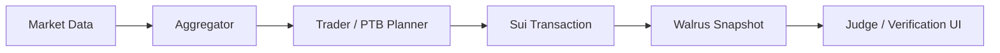

# SAPM - Sovereign Agentic Prediction Market on Sui

[](https://github.com/rwilliamspbg-ops/Sovereign-Agentic-Prediction-Market-SAPM-on-Sui-Core/actions/workflows/ci.yml)
[](https://github.com/rwilliamspbg-ops/Sovereign-Agentic-Prediction-Market-SAPM-on-Sui-Core/actions/workflows/ci_validation.yml)
[](https://github.com/rwilliamspbg-ops/Sovereign-Agentic-Prediction-Market-SAPM-on-Sui-Core/actions/workflows/lean-verification.yml)
[](https://github.com/rwilliamspbg-ops/Sovereign-Agentic-Prediction-Market-SAPM-on-Sui-Core/actions/workflows/lean-rust-runner-image.yml)
[](https://github.com/rwilliamspbg-ops/Sovereign-Agentic-Prediction-Market-SAPM-on-Sui-Core/actions/workflows/phase2-hardening-ci.yml)
[](package.json)
[](https://docs.sui.io)
[](https://github.com/rwilliamspbg-ops/Sovereign-Agentic-Prediction-Market-SAPM-on-Sui-Core/stargazers)
[](https://github.com/rwilliamspbg-ops/Sovereign-Agentic-Prediction-Market-SAPM-on-Sui-Core/network/members)
[](https://github.com/rwilliamspbg-ops/Sovereign-Agentic-Prediction-Market-SAPM-on-Sui-Core/issues)
[](https://github.com/rwilliamspbg-ops/Sovereign-Agentic-Prediction-Market-SAPM-on-Sui-Core/pulls)
[](https://github.com/rwilliamspbg-ops/Sovereign-Agentic-Prediction-Market-SAPM-on-Sui-Core/graphs/contributors)
[](https://github.com/rwilliamspbg-ops/Sovereign-Agentic-Prediction-Market-SAPM-on-Sui-Core/commits/main)
[](https://github.com/rwilliamspbg-ops/Sovereign-Agentic-Prediction-Market-SAPM-on-Sui-Core)
[](LICENSE.md)

SAPM is a Sui-based prediction market stack that combines autonomous agents, market aggregation, risk controls, and a polished Next.js frontend for live demo and judge workflows. The repository is organized as a monorepo with agent services, smart-contract sources, a frontend app, formal verification artifacts, and deployment/ops material.

**Current status:** feature-complete for the current demo scope, with release-gate validation green in this workspace and production-readiness hardening still in progress.

See [docs/INDEX.md](docs/INDEX.md) for the full documentation index.

## What SAPM Does

SAPM demonstrates a full prediction-market workflow:

1. Market discovery and board-style scanning.
2. Agent forecasting and consensus building.
3. Trade planning and Sui transaction execution.
4. Snapshot archiving to Walrus.
5. On-chain object and package inspection for verification.

The UI now includes Judge Mode, wallet-aware trade execution, Walrus archive/preview flows, DeepBook/Walrus status panels, and a production-oriented loading/error fallback layer.

## Current Capabilities

| Area | Status | Notes |
| --- | --- | --- |
| Frontend market UI | Implemented | Next.js App Router, board/cursor views, market cards, filtering, and resource hub |
| Wallet integration | Implemented | Wallet-standard connect flow with Sui-aware trade execution and session syncing |
| Judge Mode | Implemented | Guided flow for connect, on-chain read, micro trade, Walrus archive, preview |
| DeepBook integration | Present | Status checks and linkouts are wired into the UI |
| Walrus integration | Present | Snapshot publish/read flows are available from the frontend |
| Copilot Ops workflow | Implemented | Action queue can plan and execute on-chain sync, judge mode, and archive workflows |
| Agent pipeline | Implemented | Forecast, aggregation, and trade decision logic are present |
| Risk controls | Implemented | Trade preflight, notional caps, idempotency, and retry logic |
| Move contracts | Source present | Registry/incentives sources are present; deployment/runtime verification depends on environment |
| Formal verification | Present | Lean artifacts and scripts are included in the repo |
| Release validation | Green in this workspace | `npm run release:check` passes after clean bootstrap |

## Production Readiness Status (Updated)

| Component | Production Ready | Notes |
| --- | --- | --- |
| Frontend UI | Yes | Fully functional with wallet integration |
| Agent Pipeline | Yes | Forecasting and aggregation are active |
| Risk Controls | Beta | Additional hardening and policy tuning are still in progress |
| Move Contracts | Alpha | Requires deployment verification in staging/production |
| Formal Verification | Alpha | Partial proof coverage is complete; broader coverage remains |

## Known Issues

- Orchestrator hardening remains in progress for full production-grade attestation provisioning.
- Lint warning debt should continue to trend toward zero.
- On-chain package/object deployment assumptions must be verified per environment.

## Quick Start

### Prerequisites

- Node.js 18 or newer
- npm
- Docker and Docker Compose
- Optional: Sui CLI for contract work

### Install

```bash
npm install
```

If you want all package-level dependencies bootstrapped in one shot:

```bash
npm run install:all
```

### Run the stack

```bash
cd docker
docker compose up --build
```

Frontend: [http://localhost:3000](http://localhost:3000)

If you hit Docker Desktop cache or stale-image issues, run a clean restart:

```bash
cd docker
docker compose down -v --remove-orphans
docker compose build --no-cache sui-local aggregator-proxy
docker compose up -d
docker compose ps
```

### Run the frontend locally

```bash
cd frontend
npm run dev -- -p 3000
```

The frontend dev script is configured to avoid filesystem-cache issues in this workspace.

### Browser Wallet Trade Execution (End-to-End)

The trade form now enforces preflight checks and on-chain target introspection before wallet signing. Configure one of the two paths below in `frontend/.env.local`, then restart the frontend.

Option A: Registry path (current default package in this repo)

```bash
NEXT_PUBLIC_SUI_TRADE_TARGET=0x746797ce439d0e06bdb31d1b0dacc24e204e7906445292a97fb6a5734de777b8::registry::add_key
NEXT_PUBLIC_SUI_REGISTRY_OBJECT_ID=0x<your_registry_object_id>
```

Option B: DeepBook limit-order path

```bash
NEXT_PUBLIC_SUI_TRADE_TARGET=0x<deepbook_package_id>::pool::place_limit_order
NEXT_PUBLIC_DEEPBOOK_POOL_OBJECT_ID=0x<pool_object_id>
NEXT_PUBLIC_DEEPBOOK_BALANCE_MANAGER_OBJECT_ID=0x<balance_manager_object_id>
NEXT_PUBLIC_SUI_CLOCK_OBJECT_ID=0x6
```

Execution flow:

1. Open the frontend and connect a Sui wallet account on testnet or mainnet.
2. Confirm the trade form shows no preflight issues.
3. Verify the target introspection card resolves your target and parameter types.
4. Submit a trade and approve in wallet.
5. Confirm digest and SuiScan toast output after chain confirmation.

### DeepBook and Walrus Capability Coverage

Current implemented coverage in this repo:

- DeepBook: target introspection, preflight checks, and signature-aware transaction encoding for `pool::place_limit_order` in the trade form.
- DeepBook lifecycle primitives: `place_limit_order`, `cancel_order`, and replace-order transaction builders plus digest reconciliation helpers in the frontend service layer.
- Walrus: endpoint readiness checks, snapshot publish (`POST /v1/blobs`), and snapshot read/preview (`GET /v1/blobs/{blobId}`) from the UI.
- Walrus snapshot manifest: versioned `sapm.walrus.snapshot.manifest.v1` payload with checksum and lineage fields before publish.
- Sui proof path: transaction digest capture and direct SuiScan verification links in the trading flow.
- Runtime observability: structured deepbook/walrus/trade events for readiness checks, latency, preflight blocks, and execution outcomes.

Current gaps (not fully implemented yet):

- DeepBook advanced lifecycle flows such as order cancellation, partial-fill management, and richer order-book/position reconciliation.
- Walrus advanced capabilities such as richer metadata/indexing strategy, long-term retention/versioning policy, and signed retrieval attestations in UI.

CI update:

- Frontend production gate now runs as a standalone CI job with explicit timeout controls and always-uploaded logs for deterministic debugging.

Reference docs:

- DeepBook docs: https://docs.sui.io/standards/deepbookv3
- Walrus repository/docs: https://github.com/MystenLabs/walrus

## Validation and Scripts

Root-level scripts:

```bash
npm run test:trader
npm run test:aggregator
npm run test:all
npm run test:e2e
npm run check:frontend:prod
npm run bench:aggregator
npm run lint
npm run release:check
```

Current canonical gate:

```bash
npm run release:check
```

What it does:

1. Installs required dependencies.
2. Runs repository linting.
3. Runs trader and aggregator tests.
4. Verifies the root e2e suite.

Frontend production gate:

```bash
npm run check:frontend:prod
```

That gate performs a clean frontend type-check and production build.

CI gate behavior:

- `release-check` can skip frontend production build when `SKIP_FRONTEND_GATE=1` (used by CI to avoid duplicate frontend builds).
- Frontend production build runs in a standalone CI job (`frontend-prod-gate`) with explicit timeout control via `FRONTEND_BUILD_TIMEOUT_SECONDS`.
- CI uploads release and frontend gate logs as artifacts for deterministic failure triage.

## Frontend Overview

The frontend is a Next.js 14 App Router app with:

- market discovery and board views
- resource hub and documentation routes
- wallet-aware trade execution
- Judge Mode for demo/judge proof flows
- Walrus snapshot archive and preview
- DeepBook/Walrus status panels
- Copilot Ops panel with executable action queue and runtime-backed planning
- branded loading and error fallbacks to avoid blank white pages

Key entry points:

- [frontend/src/app/page.tsx](frontend/src/app/page.tsx)
- [frontend/src/app/markets/page.tsx](frontend/src/app/markets/page.tsx)
- [frontend/src/app/layout.tsx](frontend/src/app/layout.tsx)
- [frontend/src/components/TradeExecution.tsx](frontend/src/components/TradeExecution.tsx)
- [frontend/src/services/sui/wallet-standard.ts](frontend/src/services/sui/wallet-standard.ts)

## Performance

SAPM includes both application-level and datapath-focused performance work.

Current repo performance highlights:

- Aggregator benchmarking is available through root scripts.
- Datapath optimization notes and AF_XDP tuning guidance are included.
- Production-readiness and benchmark context are documented under performance_optimization.

Run the aggregator benchmark:

```bash
npm run bench:aggregator
```

Explore performance docs:

- [performance_optimization/README.md](performance_optimization/README.md)
- [performance_optimization/AF_XDP_Optimizations.md](performance_optimization/AF_XDP_Optimizations.md)
- [performance_optimization/xdp_tuning.md](performance_optimization/xdp_tuning.md)
- [performance_optimization/rust_datapath_spec.md](performance_optimization/rust_datapath_spec.md)

Performance validation in release flow:

- Use [scripts/release_check.sh](scripts/release_check.sh) for the canonical gate.
- Use [scripts/benchmark_aggregator.js](scripts/benchmark_aggregator.js) for focused aggregator throughput checks.

## Repository Layout

```text
agents/                    Agent, aggregator, trader, and registry code
ai-agents/                 Consensus/reasoning/memory helpers
attestation/               TPM and attestation utilities
cmd/                       CLI entry points
crypto/                    PQC/KEX code and tests
demo/                      Demo scripts and HTML dashboard
docker/                    Docker Compose and Nginx assets
docs/                      Canonical documentation set
formal_verification/       Lean proof artifacts and scripts
frontend/                  Next.js frontend
k8s/                       Kubernetes monitoring assets
market-data/               DeepBook/market data helpers
performance_optimization/  Performance notes and tuning docs
production-deployment-manifests/  Helm and Kubernetes manifests
risk-management/           Risk-control controls and notes
rust-datapath/             Rust datapath experiment
scripts/                   Repo automation and validation scripts
test/                      End-to-end tests
```

## Architecture Snapshot

SAPM is built around a simple flow:



At a high level:

- Agents produce forecasts and consensus.
- The trader converts that output into execution intent.
- The frontend exposes the live workflow and verification surfaces.
- The contract and deployment layers provide the on-chain target.

## Deployment and Status Notes

The repo contains the current hardening and production-readiness workstream, but not every deploy path has been exercised end-to-end in every environment. The most accurate status source is:

- [docs/PRODUCTION_STATUS.md](docs/PRODUCTION_STATUS.md)

For operational steps, see:

- [docs/OPERATIONS_RUNBOOK.md](docs/OPERATIONS_RUNBOOK.md)

For contribution workflow, see:

- [CONTRIBUTING.md](CONTRIBUTING.md)

## Getting Started For Different Roles

### Judges / Demo Reviewers

1. Start from [docker/docker-compose.yml](docker/docker-compose.yml) using `cd docker && docker compose up --build`.
2. Open the frontend at [http://localhost:3000](http://localhost:3000).
3. Use Judge Mode to walk through connect, on-chain read, micro trade, archive, and preview.
4. Review the latest status in [docs/PRODUCTION_STATUS.md](docs/PRODUCTION_STATUS.md).

### Contributors

1. Read [docs/INDEX.md](docs/INDEX.md).
2. Read [CONTRIBUTING.md](CONTRIBUTING.md).
3. Run `npm run release:check` before opening a PR.
4. Keep changes aligned with the current status docs and root scripts.

### Developers

1. Explore `frontend/src/app` for the UI.
2. Explore `agents/` for the pipeline.
3. Use `scripts/frontend_production_gate.sh` and `scripts/release_check.sh` for validation.
4. Use `npm run bench:aggregator` and the performance docs for optimization work.

## Notes On Current Validation

In this workspace, the canonical release gate passes after a clean bootstrap. The frontend has also been hardened with wallet/session validation, loading/error fallbacks, and production build checks.

For the live status snapshot, prefer [docs/PRODUCTION_STATUS.md](docs/PRODUCTION_STATUS.md) over this README.

## Contributing

Contributions are welcome. Please keep README and status docs consistent with the current codebase, especially when changing:

- frontend routes and wallet integration
- release or validation scripts
- contract sources and deployment assumptions
- operations or environment setup

## License

Apache 2.0. See [LICENSE.md](LICENSE.md).
