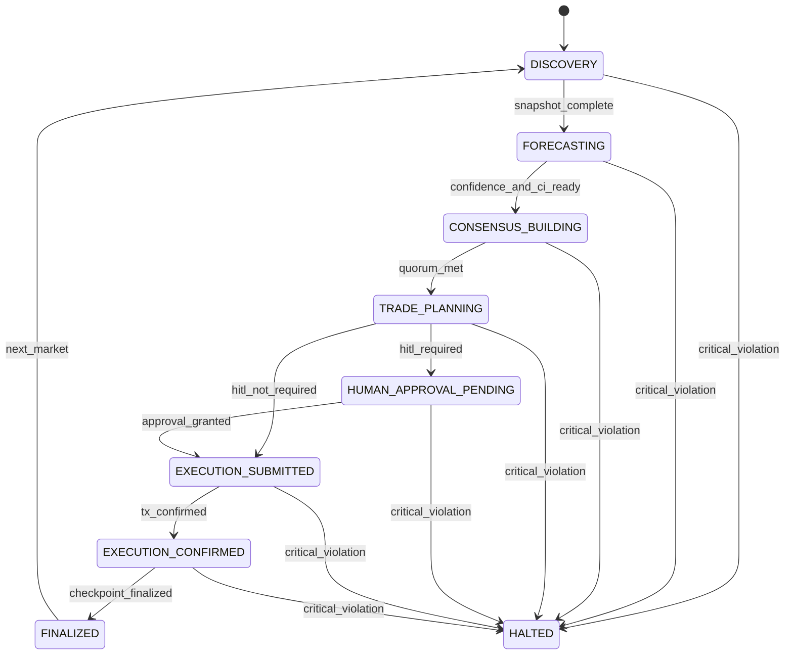

# System Finite State Machine (FSM)

This FSM formalizes legal state transitions across market lifecycle orchestration.

## Lifecycle States

1. `DISCOVERY`
2. `FORECASTING`
3. `CONSENSUS_BUILDING`
4. `TRADE_PLANNING`
5. `HUMAN_APPROVAL_PENDING`
6. `EXECUTION_SUBMITTED`
7. `EXECUTION_CONFIRMED`
8. `FINALIZED`
9. `HALTED`

## Transition Rules

- `DISCOVERY -> FORECASTING` only when canonical market snapshot is complete.
- `FORECASTING -> CONSENSUS_BUILDING` only when confidence + CI are present.
- `CONSENSUS_BUILDING -> TRADE_PLANNING` only with quorum threshold.
- `TRADE_PLANNING -> HUMAN_APPROVAL_PENDING` only if policy requires HITL.
- `TRADE_PLANNING -> EXECUTION_SUBMITTED` only if HITL is not required.
- `HUMAN_APPROVAL_PENDING -> EXECUTION_SUBMITTED` only with explicit approval artifact.
- `EXECUTION_SUBMITTED -> EXECUTION_CONFIRMED` only with chain digest confirmation.
- `EXECUTION_CONFIRMED -> FINALIZED` only with checkpoint finalization.
- Any state -> `HALTED` on critical safety violation.

Illegal transitions must be rejected and logged as policy errors.

## Mermaid Diagram

## Suggested Formalization Path

1. Encode this FSM in Lean/TLA+ as transition invariants.
2. Build runtime guard checks at orchestrator boundary.
3. Emit current state and transition event in canonical envelope for observability.